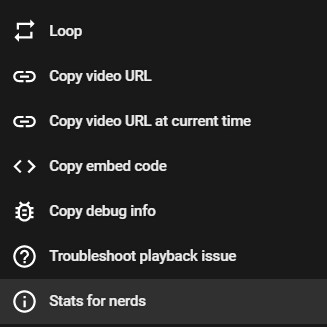

# SRT Retimer
A forked retimer from **[queueclient](https://github.com/randomidiot13/queueclient)** created by **[randomidiot13](https://github.com/randomidiot13)** but modified a bit

# How to use it
First, go to the run you want to retime, this video has to be in Google Drive or in Youtube

Right click the video and click `Stats for nerds`

# Features
This retimer has a few features, heres a list of em:

**Rejection messages**
