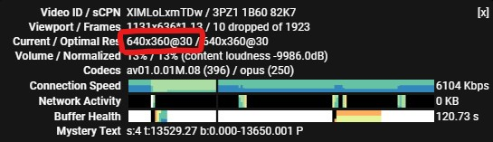
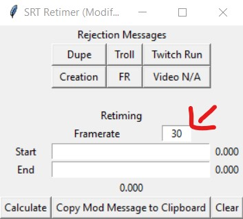
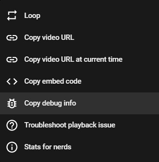
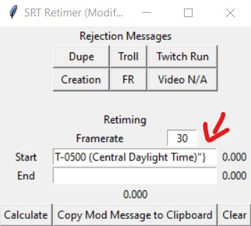
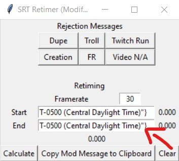
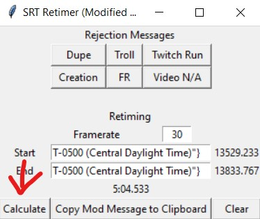
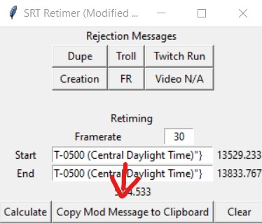
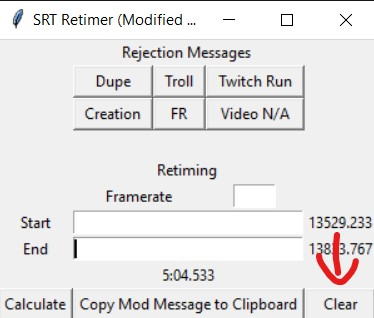

# SRT Retimer
A forked retimer from **[VerifClient v2](https://github.com/randomidiot13/queueclient)** created by **[randomidiot13](https://github.com/randomidiot13)** but modified a bit.

# Dowloading Instructions (Windows)
First, you need to have Python 3.x or above to run the file. (.exe file soon!)

Afer you have downloaded Python, go to command prompt and type `python`

If you get this result:

```
C:\Users\Example>python
Python 3.x.x (bunch of other stuff)
```

You succesfully downloaded Python!

If you get a diffrent result, try downloadid Python again, or folow a tutorial on YouTube admireAAA

Now download the Python script [here]()

After downloading, you should be able to duble click the script and boom, you are ready to verify some runs!

# Downloading Instructions (Linux and Mac)
Unaffortunatelly, I have not tested (and have no idea) how to download this on this OS. If you would like to contribute, you can make a PR and I can merge it.

Also, if you know how to make an executable on Linux and/or Mac, please let me know **@icky#2264**. Thank you!

# How to use it
First, go to the run you want to retime, this video has to be in Google Drive or in Youtube

Right click the video and click `Stats for nerds`


After that you will see a box that comes up in the top left corner of the video, you will look `Current / Optimal Res` section and look for the `@`. Place the numbers after the `@` in the `Framerate` text box of the retimer.

For example, if it says `1920x1080@30` your gonna put `30` on the `Framerate` text box of the retimer.





After that, go to the first framee where the runs starts, right click the video and press `Copy debug info`. And copy it on the `Start` text box of the retimer.

**Reminder you CAN'T put individual numbers, you have to paste the debug info, so you cant put numbers, only the debug info**





Do the same thing for the last frame of the run



Now press `Calculate` and it will calculate the time.



You can also copy teh mod message (without and ad!). Just press the `Copy Mod Message to Clipboard` button and paste it on the mod message.



And now you can clear all the text boxes from the retimer from pressing `Clear`



And boom, you retimed a run!

# Features
This retimer has a few features, heres a list of em:

**Rejection messages**
There are 6 buttons, each one with diffrent rejection messages

**Clear Button**
Clear all teh text boxes when your done verifing a run

**Mod Message**
A mod message button without an ad!

# What if you want to modify the Rejection Messages or the Mod Message?
No problem! you can just open up a text editor, and go to `# Rejection Buttons` and `# Edit Messages` to edit the rejection buttons and edit the messages of teh both the rejection buttons and Mod Message

# QnA
**Can I use this for modding?**

Of course you can!

**How can I remove the console when i run the Sript?**

Just change the extension from `.py` to `.pyw` and that will remove the console.

# Credit
Thanks to **[randomidiot13](https://github.com/randomidiot13)** for creating the original **[VerifClient](https://github.com/randomidiot13/queueclient)**

# Other
If you have any questions, please let me know **@icky#2264**. If you would like to see the whole list of Speedrunning tools, you can go [here](https://github.com/Speedrunning-Tools) and find the list of tools there!
